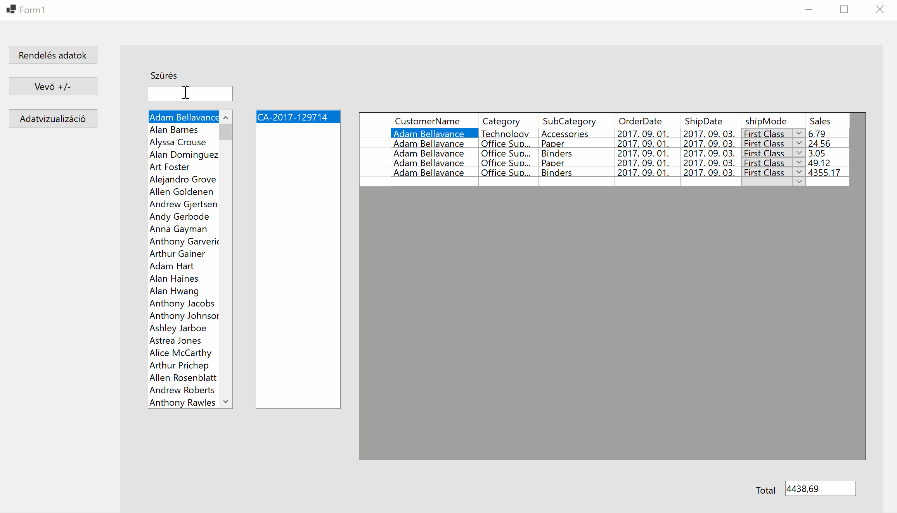

# Rendelés Nyilvántartó Alkalmazás

## Rövid leírás

Az alkalmazás egy egyetemi munka kereteiben készült, részleges megoldást kínál a rendelések nyilvántartására és kezelésére. Egy zárthelyi dolgozat során mindössze másfél óra állt rendelkezésre felépíteni az előre megtervezett applikációt, így részletesebb kidolgozásra nem volt lehetőség.
Az első UserControlon a vevőkre, és azok rendelései szűrve lehet lekérdezni a rendelés adatait, míg a második a vevők, és adaitaiknak az adatbázishoz való hozzáadására, valamint törlésére szolgál.
A harmadik UserControl pedig adatvizualizációs célokat szolgál, itt az összes árbevétel oszlopdiagramjait lehet megtekinteni, van lehetőség különböző szempontok szerint csoportosítani azt.
Az alkalmazás saját tervezésű adatbázisban tárolt adatokaz használ fel és manipulál.

